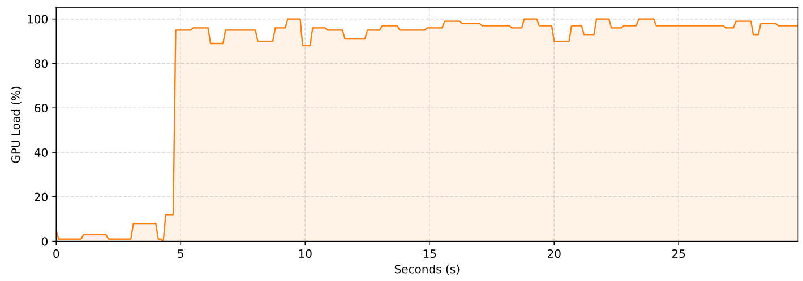
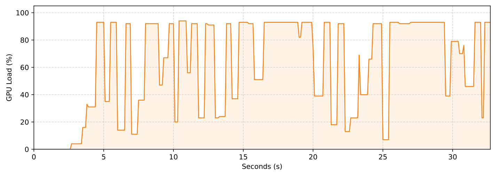

# LLM_RAG
A CLI implementation of a locally-run LLM (**Phi-3.5-mini-instruct**) with **RAG (Retrieval-Augmented Generation)**.

## Setup (`Windows`, `NVIDIA GPU`)
### 1. Install Python
- Version: **3.11.6** (use `python --version` to check)
- [Download Python for Windows official site](https://www.python.org/downloads/windows/)

### 2. Install dependencies
- Execute `setup_cuda.bat`,  `setup_dml.bat` or `setup_cpu.bat`
- The script will:
  1. Create a virtual environment and download required packages.
     - It will ask to manually insert torch pip installation command (for correct CUDA)
  2. Download **Phi-3.5-mini-instruct** (GPU, CPU).
  3. Install correct onnxruntime-genai (CUDA, DML, CPU)


## How to run (CMD)
- Enter virtual environment: `venv_cuda\Scripts\activate` `venv_dml\Scripts\activate` `venv_cpu\Scripts\activate`
### CLI app
- `python main.py -h` for more information
-  Installs `sentence-transformers/multi-qa-MiniLM-L6-cos-v1` (22.7M params) and `cross-encoder/ms-marco-MiniLM-L6-v2` (22.7M params) on first run for RAG

    ```
    python main.py -m gpu/gpu-int4-awq-block-128 -e cuda
    ```
    ```
    python main.py -m gpu/gpu-int4-awq-block-128 -e dml
    ```
    ```
    python main.py -m cpu_and_mobile/cpu-int4-awq-block-128-acc-level-4 -e cpu
    ```

### Benchmarking
- `python benchmark.py -h` for more information

    ```
    python benchmark.py -m gpu/gpu-int4-awq-block-128 -e cuda
    ```
    ```
    python benchmark.py -m gpu/gpu-int4-awq-block-128 -e dml
    ```
    ```
    python benchmark.py -m cpu_and_mobile/cpu-int4-awq-block-128-acc-level-4 -e cpu
    ```

## Benchmark results
- `Windows 11`, `GeForce RTX 4060`, `Intel Core i5-12400f`
- `Batch size: 1`, `max_length: 2048`, `warmup_rounds: 2`, `benchmark_rounds: 30`

| Metric | cpu (baseline) | cuda | dml |
|:-:|:-:|:-:|:-:|
| TTFT (avg) | 15.59s | **0.28**s  | 0.64s |
| Output TPS (avg) | 12.61 tok/s | **84.30** tokens/s | 67.41 tok/s |
| Input TPS (avg)| 53.36 tok/s | **2780.67** tokens/s | 1164.17 tok/s |
| Model Load Time (done once) | 2.23s | **1.71**s | 1.80s |

<h3 align="center">GPU Load (CUDA)</h3>
<p align="center">
  
</p>

<h3 align="center">GPU Load (DirectML)</h3>
<p align="center">
  
</p>

## RAG implementation
    [ INPUT: query ]
                  |
                  v
    +-----------------------------+
    |     Bi-Encoder Encoding     | --> bi_encoder.encode([query])
    +--------------+--------------+
                  |
                  v
    +-----------------------------+
    |      Initial Retrieval      | --> index.search(..., top_k)
    |      (Vector Search)        |
    +--------------+--------------+
                  |
                  | [ initial_chunks ]
                  v
    +-----------------------------+
    |     Cross-Encoder Rerank    | --> cross_encoder.predict(pairs)
    |  (Score Query+Chunk Pairs)  |
    +--------------+--------------+
                  |
                  | [ scored_chunks (Sorted) ]
                  v
    +-----------------------------+
    |          Heuristic          |
    |                             |
    |    For each score pair:     |    
    |      diff = S[i] - S[i+1]   |
    +--------------+--------------+
                  |
                  | [ relevant_chunks (top chunks before the max(diff)) ]
                  v
    +-----------------------------+
    |     Character Threshold     |
    |                             |
    |  Iterate chunks while:      |
    |  total_chars + len(chunk)   |
    |       <= max_chars          |
    +-----------------------------+
                  |
                  v
    [ OUTPUT: context ]
